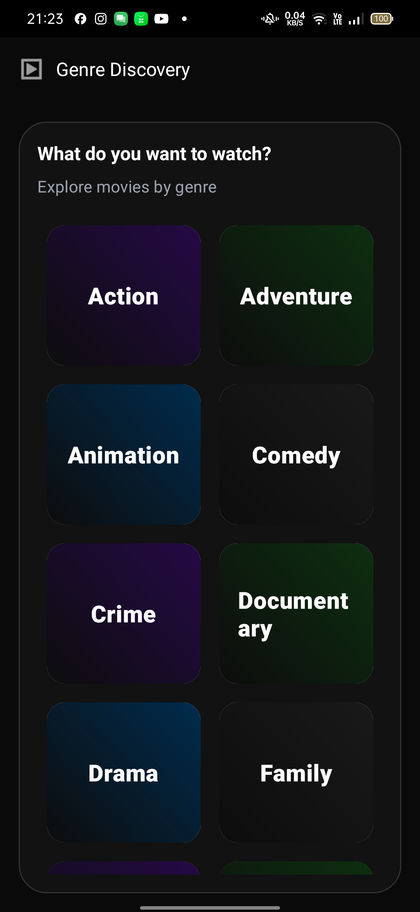
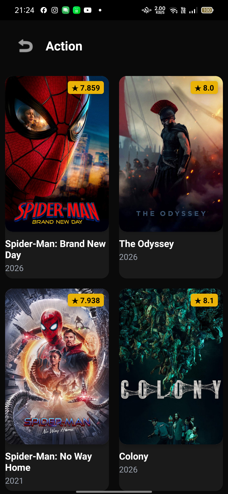
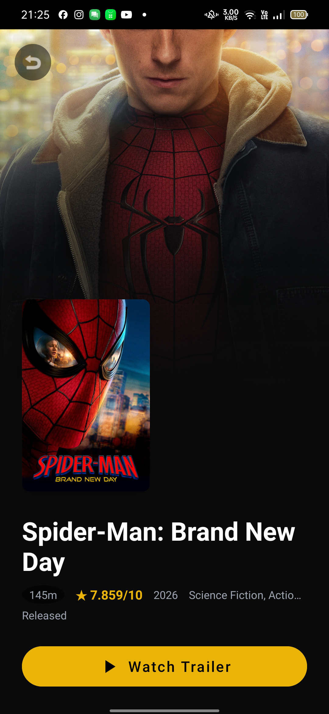
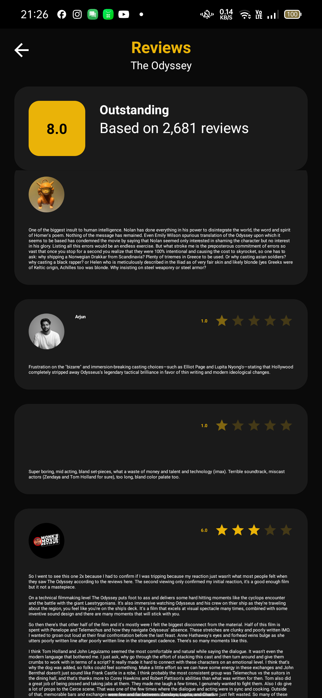
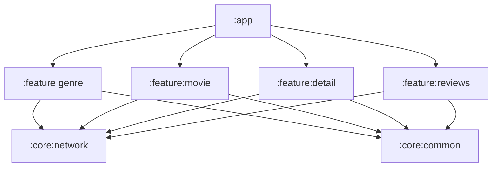

# Movie Explorer

A native Android application built with Kotlin that allows users to explore movies by genre, view movie details, read user reviews, and watch movie trailers using The Movie Database (TMDB) API.

This project was developed as a technical interview submission, demonstrating clean code practices, multi-module architecture, and robust engineering decisions.

## Screenshots

| Genres | Movie Discovery |
|--------|-----------------|
|  |  |

| Movie Detail | Reviews |
|--------------|---------|
|  |  |

## Features

- **Browse Movie Genres**: View a list of official movie genres from TMDB.
- **Movie Discovery**: Discover movies filtered by selected genres.
- **Detailed View**: Access comprehensive information about a specific movie.
- **User Reviews**: Read what other users have to say about the movie.
- **Movie Trailers**: Watch trailers directly via YouTube integration.
- **Endless Scrolling**: Seamless pagination for movies and reviews.
- **Local Caching**: Genre data is cached using Room for offline accessibility.
- **Robust Error Handling**: Distinct handling for network failures, empty results, and pagination errors.
- **Retry Mechanism**: Quick actions to retry failed network requests.
- **Loading States**: Visual feedback during data fetching.

## Technology Stack

| Category | Technology |
|----------|------------|
| Language | Kotlin |
| UI | XML + ViewBinding |
| Architecture | MVVM + Clean Architecture |
| Project Structure | Multi-Module |
| Networking | Retrofit 2 + OkHttp 4 |
| API Format | REST / JSON |
| Asynchronous | Kotlin Coroutines |
| Reactive | Kotlin Flow / StateFlow |
| Local Storage | Room |
| Dependency Injection | Dagger 2 (via KSP) |
| Image Loading | Coil |
| Testing | JUnit 4, MockK, Coroutines Test |
| API | The Movie Database (TMDB) |

## Architecture

The project follows **Clean Architecture** principles combined with an **MVVM** presentation pattern and a **Multi-Module** structure to ensure separation of concerns, scalability, and testability.



### Layer Responsibility

- **Presentation**: Handles UI logic using Fragments and ViewModels. Uses `StateFlow` to emit UI states.
- **Domain**: Contains business logic, UseCases, and Repository interfaces. This layer is pure Kotlin/Java and independent of Android frameworks.
- **Data**: Implements Repository interfaces, manages Remote (Retrofit) and Local (Room) data sources, and performs data mapping.
- **Core**: Shared infrastructure such as networking, common utilities, and base classes.

## Module Structure

The project is organized into functional modules:

```text
the-movie-db
├── app                 # Entry point, DI setup, and navigation
├── core
│   ├── common          # Shared utilities and base classes
│   └── network         # Centralized Retrofit configuration and API security
└── feature
    ├── genre           # Genre list and local caching
    ├── movie           # Movie discovery with pagination
    ├── detail          # Movie details and metadata
    └── reviews         # User reviews and YouTube trailers
```

## Feature Architecture

Each feature module follows a layered structure. Taking **Genre** as an example:

```text
feature:genre
│
├── presentation        # Fragments, ViewModels, and UI State
│   ├── GenreFragment
│   └── GenreViewModel
│
├── domain              # UseCases and Repository interfaces
│   ├── model/Genre
│   ├── repository/GenreRepository
│   └── usecase/GetGenresUseCase
│
└── data                # Remote/Local sources and Mapper
    ├── local/GenreDao
    ├── remote/GenreRemoteDataSource
    └── repository/GenreRepositoryImpl
```

## Data Flow

The application enforces a unidirectional data flow:

```text
Fragment → ViewModel → UseCase → Repository → Data Source → API/Room
```

The UI observes the `StateFlow` from the ViewModel and never interacts directly with repositories or data sources.

## Local Caching

A **Network-First** strategy is implemented for Genres to ensure data is available offline while staying fresh when a connection exists.

1. **Attempt Network Request**: Fetch genres from TMDB API.
2. **On Success**: Save/Update genres in the local **Room** database.
3. **On Failure**: Automatically fall back to the Room database.
4. **Display**: Show cached data if available; otherwise, show an error state.

> [!TIP]
> Room is currently scoped to the `:feature:genre` module. This architectural decision keeps the database logic encapsulated where it's needed, avoiding unnecessary shared infrastructure for features that don't yet require persistence.

## Pagination

Endless scrolling is implemented manually using `RecyclerView.OnScrollListener` to maintain full control over the loading state and error handling.

- **Initial Load**: Fetches the first page. Shows a full-screen loading/error/empty state.
- **Scroll to Bottom**: Triggers fetching the next page.
- **Append Data**: New results are appended to the existing list via `StateFlow`.
- **Error Handling**: If a next-page request fails, the user is notified via a snackbar or footer error, while previously loaded data remains visible.

## API & Security

The application uses **The Movie Database (TMDB) API**.

### Security Note
Sensitive information like the **API Key** is stored in native C++ code within the `:core:network` module. This provides an additional layer of protection against reverse engineering and prevents the key from being easily extracted from the APK strings.

## Getting Started

### Requirements
- Android Studio Ladybug (or newer)
- JDK 17+
- Android SDK 37 (Compile/Target)
- TMDB API Key

### Installation

1. Clone the repository:
   ```bash
   git clone https://github.com/dpradana/the-movie-db.git
   ```
2. Open the project in Android Studio.
3. The API Key is currently hardcoded in `core/network/src/main/cpp/network.cpp` for demonstration. In a production environment, this would be injected via a CI/CD secret or local property.

### Build & Run
- **Build Debug APK**: `./gradlew assembleDebug`
- **Run Unit Tests**: `./gradlew test`

## Testing

The project emphasizes testability through Dependency Injection and clean separation of concerns.

- **Unit Tests**: Implemented for ViewModels, UseCases, and Repositories using **MockK** for mocking and **Kotlinx Coroutines Test** for handling asynchronous logic.
- **DAO Tests**: Room DAOs are tested using **AndroidX Test** and an in-memory database to ensure data integrity and query correctness.
- **Logic Coverage**: Tests cover success scenarios, empty states, error handling, and pagination edge cases.

## Technical Decisions

- **Multi-Module**: Chosen to improve build times and enforce strict visibility boundaries between features.
- **Dagger 2**: Used for compile-time dependency injection, ensuring that dependencies are satisfied and components remain testable.
- **Manual Pagination**: Selected over Paging 3 to keep the implementation lightweight and tailored to the specific UI requirements, while demonstrating deep understanding of scroll listeners and state management.
- **Clean Architecture**: Ensures the business logic (Domain) is isolated from infrastructure (Data) and UI (Presentation).

## Limitations & Future Improvements

- **Cache Scope**: Currently, only Genres are cached. Future iterations could extend this to Movie Discovery results.
- **Offline Support**: Full offline support for Movie Details and Reviews is not yet implemented.
- **UI Testing**: Comprehensive Espresso or Compose UI tests could be added for critical user journeys.
- **Dark Mode**: Basic support is provided, but could be refined with custom color tokens.

---
**Project Status**: Completed / Technical Interview Submission
